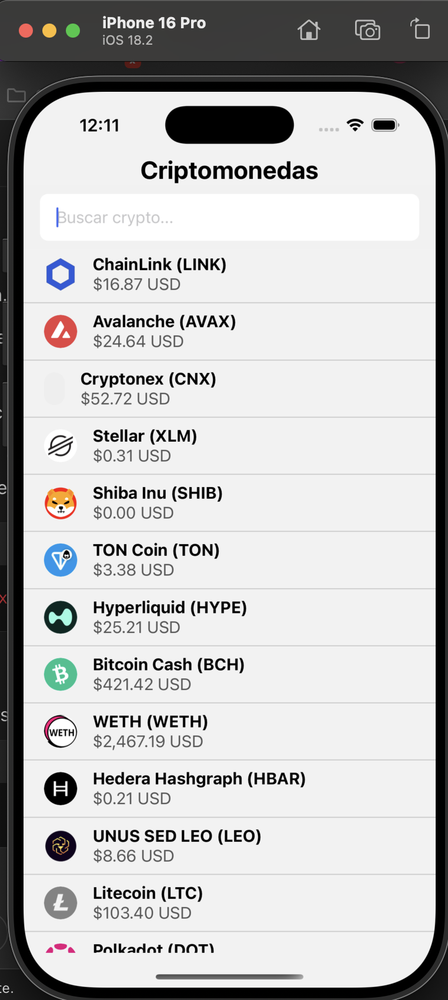
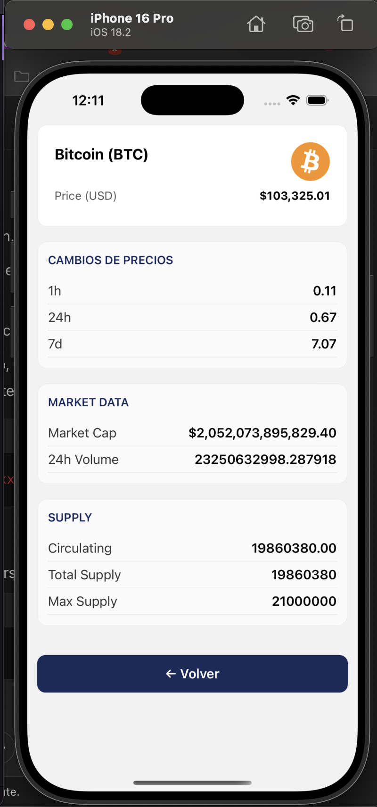

# Proyecto de App Móvil React Native

Este es un proyecto de aplicación móvil desarrollado con **React Native**.

## Requerimientos

Antes de comenzar, asegúrate de tener las siguientes herramientas instaladas en tu máquina:

- **Node.js** v22.13.0
- **Yarn** (para gestionar las dependencias)
- **Xcode** (para iOS)
- **Android Studio** (para Android)

## Instalación

### 1. Clona el repositorio

Primero, clona el repositorio de la aplicación:

```bash
git clone https://github.com/jddiazdev/million_tecniical_test.git
cd million_tecniical_test

```
### 2. Intalar con yarn 

```bash
cd million_tecniical_test

yarn install 
```

### 2. ajustar archivo .env

```bash
mv .envexample .env
```

### 3. correr en android

```bash
npx react-native run-android

```
### 4. correr en ios

asegurese de tener un emulador corriendo

```bash
cd ios 
pod install 
cd ..
npx react-native run-ios
```

### 5. Imagene de ejemplos



### 6. Imagene de ejemplos




